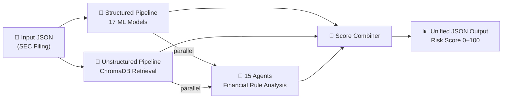

# 🛡️ Questor — Advanced Multi-Agent Fraud Detection System

<div align="center">

[](https://www.python.org/downloads/)
[](LICENSE)
[](#-15-fraud-detection-agents)
[](#-structured-pipeline--ml-ensemble)
[](https://github.com/ChaudaryAbdullah/Questor/graphs/commit-activity)
[](http://makeapullrequest.com)

**A state-of-the-art fraud detection system combining 17 ML models, document text analysis, and 15 specialized financial agents into a unified risk score.**

[🚀 Quick Start](#-quick-start) • [🏗️ Architecture](#️-architecture) • [🤖 Agents](#-15-fraud-detection-agents) • [📊 Output](#-example-output) • [📖 Docs](#-documentation)

</div>

---

## ✨ What's Inside

### 🔷 Structured Pipeline — 17-Model ML Ensemble
Processes structured JSON financial data through a weighted ensemble:
- **Classification**: CatBoost, XGBoost, LightGBM, Random Forest, SVM, DNN, CNN, Logistic Regression, Decision Tree
- **Anomaly Detection**: Isolation Forest, One-Class SVM, LOF, DBSCAN, KMeans, GMM, PCA Anomaly, Autoencoder
- Weights based on training AUC — best models contribute most
- Output: fraud probability + risk level (MINIMAL → CRITICAL)

### 🔶 Unstructured Pipeline — Document Analysis
Retrieves pre-processed SEC filings from ChromaDB by CIK number:
- Keyword-based fraud indicator scoring (`material weakness`, `restatement`, `going concern`...)
- Entity extraction and relationship mapping
- **Retrieval mode**: ~2–4s (vs. 600s+ full reprocessing)

### 🤖 Agent System — 15 Specialized Fraud Agents
Rule-based financial fraud agents, each scoring 0–100:
- 14 agents work on **single-year data** (no year-over-year needed)
- Results are weighted, normalized, and combined into one agent score

---

## 🤖 15 Fraud Detection Agents

| # | Agent | What It Detects |
|---|-------|----------------|
| 1 | **Altman Z-Score** | Bankruptcy / financial distress (Z < 1.81 = danger zone) |
| 2 | **Cash Flow vs. Earnings** | Accrual ratio — gap between book income and operational cash |
| 3 | **Debt Ratio Anomaly** | Extreme leverage, interest coverage collapse |
| 4 | **Related Party Transactions** | Suspicious related-party balance exposure |
| 5 | **Expense Padding** | Inflated operating expenses vs. revenue |
| 6 | **Tax Rate Anomaly** | Near-zero ETR on profitable company; cookie jar reserves |
| 7 | **Financing Red Flags** | Negative CFO funded by stock issuances / new debt |
| 8 | **Asset Quality** | Opaque/intangible assets dominating the balance sheet |
| 9 | **EPS Consistency** | Reported EPS vs. net income ÷ shares arithmetic check |
| 10 | **Negative Equity** | Technical insolvency; accumulated deficit vs. paid-in capital |
| 11 | **Liquidity Crunch** | Cash ratio, quick ratio, ending cash vs. burn rate |
| 12 | **Depreciation Anomaly** | D&A rate implying 50+ year asset life (profit inflation) |
| 13 | **Cash Flow Composition** | Operations vs. investing vs. financing as cash sources |
| 14 | **Benford's Law** | First-digit distribution deviation in financial figures |
| 15 | **Beneish M-Score** | 8-ratio earnings manipulation score *(needs YoY data)* |

> 📖 Full agent documentation → [`Main_Immplementation/agents/README.md`](Main_Immplementation/agents/README.md)

---

## 🏗️ Architecture

```
Questor/
├── Main_Immplementation/          # 🎯 Production pipeline
│   ├── run_unified.py             # ENTRY POINT — runs everything
│   ├── score_combiner.py          # Weighted final risk score
│   │
│   ├── stuctured_pipeline/        # 🔷 17-model ML ensemble
│   │   ├── inference_pipeline.py
│   │   ├── json_to_features.py    # Feature extraction
│   │   ├── MyModels/              # Trained model files
│   │   └── README.md
│   │
│   ├── unstructured_pipeline/     # 🔶 ChromaDB document retrieval
│   │   ├── pipelines/
│   │   ├── databases/             # ChromaDB + Neo4j
│   │   ├── utils/                 # CIK extractor
│   │   └── README.md
│   │
│   ├── agents/                    # 🤖 15 fraud detection agents
│   │   ├── orchestrator.py
│   │   ├── agent_config.yaml      # Weights + thresholds
│   │   └── README.md
│   │
│   ├── Input/                     # SEC JSON filing inputs
│   └── Output/                    # Unified results JSON
│
├── Scrapper/                      # Data scraping tools
├── Script/                        # Utility scripts
└── README.md                      # ← You are here
```

### Data Flow



---

## 🚀 Quick Start

### Prerequisites
- Python 3.9+
- ChromaDB data (pre-populated with SEC filings)
- Trained ML models in `Main_Immplementation/stuctured_pipeline/MyModels/`

### Installation

```bash
git clone https://github.com/ChaudaryAbdullah/Questor.git
cd Questor/Main_Immplementation

# Create virtual environment and install dependencies
python -m venv venv
source venv/bin/activate        # Windows: venv\Scripts\activate
bash setup.sh                   # installs all requirements
```

### Run the Pipeline

```bash
# Place your SEC JSON filing in Input/
cp your_filing.json Input/

# Run the full pipeline
python3 run_unified.py

# Options
python3 run_unified.py --no-agents       # skip agents (faster)
python3 run_unified.py --input-dir /path # custom input directory
python3 run_unified.py --no-save         # don't write output file
```

Results appear in `Output/unified_results_<timestamp>.json`.

---

## 📊 Example Output

```json
{
  "cik": "1040719",
  "filename": "0001040719.json",

  "structured": {
    "risk_score": 0.0837,
    "risk_level": "MINIMAL",
    "overall_prediction": "NORMAL",
    "models_predicting_fraud": ["Dbscan", "Isolation Forest", "Oneclass Svm"],
    "total_models": 17
  },

  "agents": {
    "combined_score": 75.4,
    "agents_succeeded": 13,
    "individual_results": {
      "altman_zscore":        { "score": 83.6, "findings": ["Z-Score 0.24 — DISTRESS zone"] },
      "financing_red_flags":  { "score": 80.0, "findings": ["Stock issuances funding cash burn"] },
      "cashflow_composition": { "score": 75.0, "findings": ["Core business is cash-negative"] },
      "debt_anomaly":         { "score": 55.6, "findings": ["ICR -2.64, cannot cover interest"] },
      "liquidity_crunch":     { "score": 55.0, "findings": ["Cash < burn rate this period"] }
    }
  },

  "combined": {
    "combined_risk": {
      "overall_risk_score": 52.51,
      "risk_level": "MEDIUM",
      "confidence": 0.72
    }
  }
}
```

### Risk Levels

| Score | Level | Action |
|-------|-------|--------|
| 0–19 | **MINIMAL** | Routine processing |
| 20–39 | **LOW** | Periodic monitoring |
| 40–59 | **MEDIUM** | Detailed review |
| 60–79 | **HIGH** | Formal investigation |
| 80–100 | **CRITICAL** | Immediate escalation |

---

## ⚡ Performance

| Component | Time |
|-----------|------|
| ML ensemble (17 models) | ~12s |
| ChromaDB retrieval | ~2–4s |
| 15 agents | ~1s |
| Score combination | <0.1s |
| **Total end-to-end** | **~15–18s** |

---

## 📖 Documentation

| Document | Contents |
|----------|----------|
| [`Main_Immplementation/README.md`](Main_Immplementation/README.md) | Full pipeline guide, config reference, troubleshooting |
| [`Main_Immplementation/agents/README.md`](Main_Immplementation/agents/README.md) | All 15 agents — design, API, how to add new ones |
| [`Main_Immplementation/stuctured_pipeline/README.md`](Main_Immplementation/stuctured_pipeline/README.md) | 17 models, feature engineering, output format |
| [`Main_Immplementation/unstructured_pipeline/README.md`](Main_Immplementation/unstructured_pipeline/README.md) | ChromaDB retrieval, risk scorer, Neo4j setup |
| [`CONTRIBUTING.md`](CONTRIBUTING.md) | Contribution guidelines |

---

## 🛠️ Advanced Configuration

### Enable/Disable Agents (`agents/agent_config.yaml`)

```yaml
agents:
  altman_zscore:
    enabled: true
    weight: 0.20      # higher = more influence on combined score
    safe_zone: 2.99

  tax_rate_anomaly:
    enabled: true
    weight: 0.08

  beneish_mscore:
    enabled: false    # disable if no year-over-year data available
```

### CLI Reference

| Flag | Description |
|------|-------------|
| `--input-dir` | Input directory (default: `Input/`) |
| `--no-agents` | Skip all agents |
| `--no-save` | Don't write output file |

---

## 🤝 Contributing

Contributions are welcome — especially new fraud detection agents!

```bash
# Development setup
pip install -r requirements.txt
pytest Main_Immplementation/tests/
```

See [`CONTRIBUTING.md`](CONTRIBUTING.md) for guidelines.

---

## 📝 Citation

```bibtex
@software{questor2026,
  title  = {Questor: Advanced Multi-Agent Fraud Detection System},
  author = {Chaudary, Abdullah},
  year   = {2026},
  url    = {https://github.com/ChaudaryAbdullah/Questor}
}
```

---

## 📞 Contact

- **Author**: Abdullah Shakir
- **GitHub**: [@ChaudaryAbdullah](https://github.com/ChaudaryAbdullah)
- **Project**: [github.com/ChaudaryAbdullah/Questor](https://github.com/ChaudaryAbdullah/Questor)

---

## 📜 License

MIT License — see [LICENSE](LICENSE)

---

<div align="center">

**⭐ Star this repository if you find it helpful!**

Made with ❤️ by the Questor Team | Version 3.0 — March 2026

</div>
